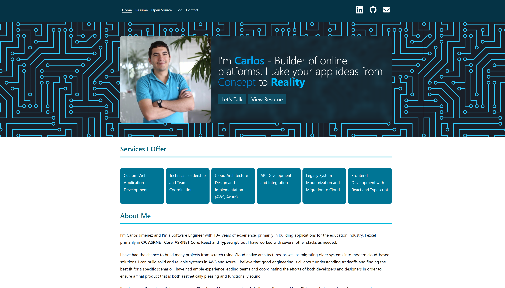
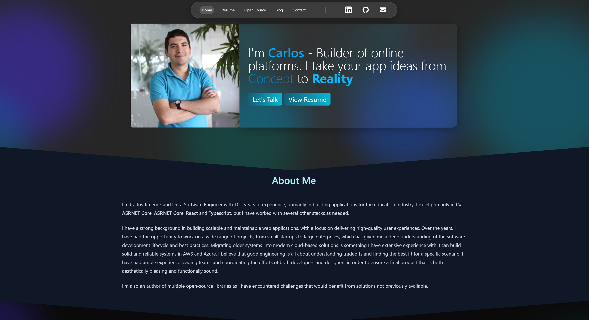

I am not a designer. I've worked closely with design teams over the years, and that experience gave me enough of an eye to know when something isn't working — but not necessarily how to implement a breath-taking design from scratch. This site was the perfect example of that: consistent, but dated. It wasn't embarrassing, but it wasn't doing me any favors either.

So with all the recent buzz, I decided to give Claude Opus 4.6 in agent mode a shot. My plan was simple, use GitHub Copilot (The tool I'm familiar with) and attempt what I'd describe as a "vibe coded" redesign. I had a general aesthetic direction in mind, but no formal design spec, no mockups, and no design system to work from.

## Starting with a Direction, Not a Spec

The first thing I did was spend some time on Dribbble looking at personal sites. I wasn't looking for something to copy pixel-for-pixel — the resolution on most Dribbble shots for personal sites isn't high enough to make that practical anyway. What I was really doing was narrowing down what I wanted my website to look like. I wanted to be able to describe features of what I wanted and hope Claude would help me write it faster than I would myself if I was writing all the code. I had tried this with weaker models before, and it was unsuccessful.

Once I had a rough sense of the aesthetic I wanted, I structured my prompts in two distinct phases. The first phase was purely generative: get Claude to produce a sample layout file for my Astro blog using Tailwind, something that captured the spirit of the disjointed ideas of what I liked on dribbble. The second phase was iterative: once polished, take that sample, turn it into a real layout component, and apply it page by page.

## Before and After

## What Actually Surprised Me

I'll be honest — I came into this with fairly low expectations. The last time I had seriously tried to use agent mode for frontend work, the experience was more frustrating than productive. The cognitive load of correcting the model, finding the right words to express what I wanted, and managing the back and forth ended up being worse than just making the changes myself. That's especially true when your idea of what you want isn't fully formed yet, which, on my personal projects, is the more common occurrence.

The first prompt was something like "Create a version of this page using a dark theme, changing text colors appropriately using Tailwind CSS". It wasn't anything groundbreaking, but I was surprised to be pleased with the resulting design from the beginning, this surprised me. Looking at the planning notes and the output made me realize that something had changed with this recent model. Claude produced something genuinely close to what I had in mind. Not yet finished (I wasn't expecting it to be), but it was directionally correct in a way that I could work with to finish by making a few prompts about design elements I had never done by hand before, like the blob effects and glassmorphism.

## Scope and Intent

In previous experiences with AI coding tools, I had noticed two recurring failure modes when it came to understanding the scope of a change. Sometimes the model would interpret my intent as much broader than it was, touching things I hadn't asked it to touch. Other times, the scope was right but the intent was missed — the change technically happened, but it didn't do what I actually wanted it to do. Both scenarios lead to the same outcome: an annoying back and forth that makes the tool feel less like a productivity multiplier and more like rubber ducking with extra steps.

With Opus 4.6, I found myself running into those failure modes a lot less. I still made a handful of manual adjustments throughout the process, but in general, Claude was better at reading what I actually meant, not just what I literally said. That distinction matters more than it sounds.

Going page by page helped too. I wasn't greedy. I reviewed each result before moving forward, made small corrections when needed, and kept the scope of each prompt tight. By the time one prompt finished, I already had a clear idea of what I wanted to ask next. That feedback loop felt natural in a way that earlier experiences hadn't.

## Changing My Baseline Expectation

I used to think using AI for development was roughly a 60/40 proposition. Sometimes the output was great and close to what I needed, perhaps even better considering the little initial effort I put. Other times it was a complete flop, and the energy spent on it felt like a net negative. That framing made AI tools feel like a gamble rather than a reliable part of a workflow, something I would rely one when my mind was tired, not something I would rely on for writing the code I already had in my head.

After this experience, I'd revise that estimate to something closer to 85/15. That shift is significant. It's the difference between a tool you reach for occasionally when you're feeling lucky, and one you can actually build a process around. 

To borrow from *The Lean Startup*, what this really changes is the speed at which I can move through the Build phase. The faster I can get something in front of people, the sooner I get to Measure and Learn — the parts of the loop that actually tell me whether what I built matters. If AI can reliably accelerate the build, that compounding effect on iteration speed is where the real productivity gains are. 

That's not a small thing. And it's the first time I've felt like the technology actually lives up to what it's been promising for years. If code is cheap, then creating POCs I can throw away is worth it, so that I can develop an idea before commiting to any one specific codebase, be that at the repository level, or at the level of a single file meant to replace another.
